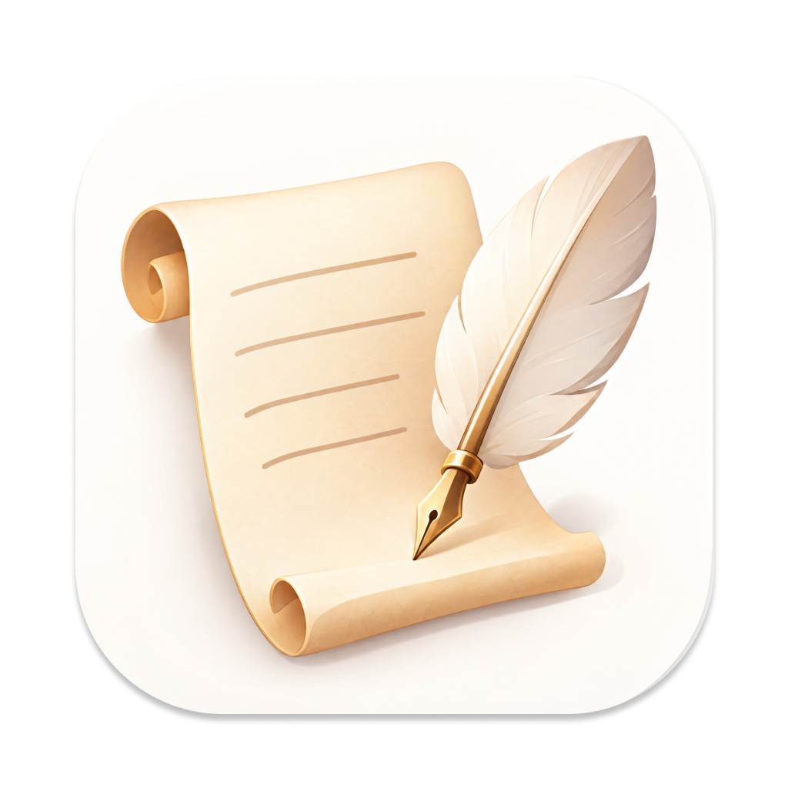
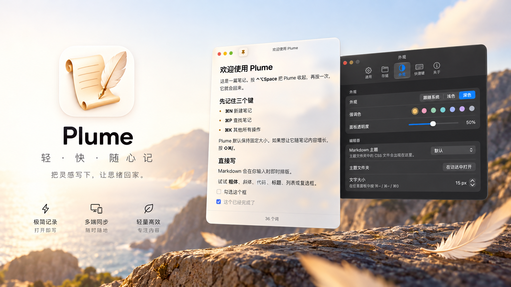
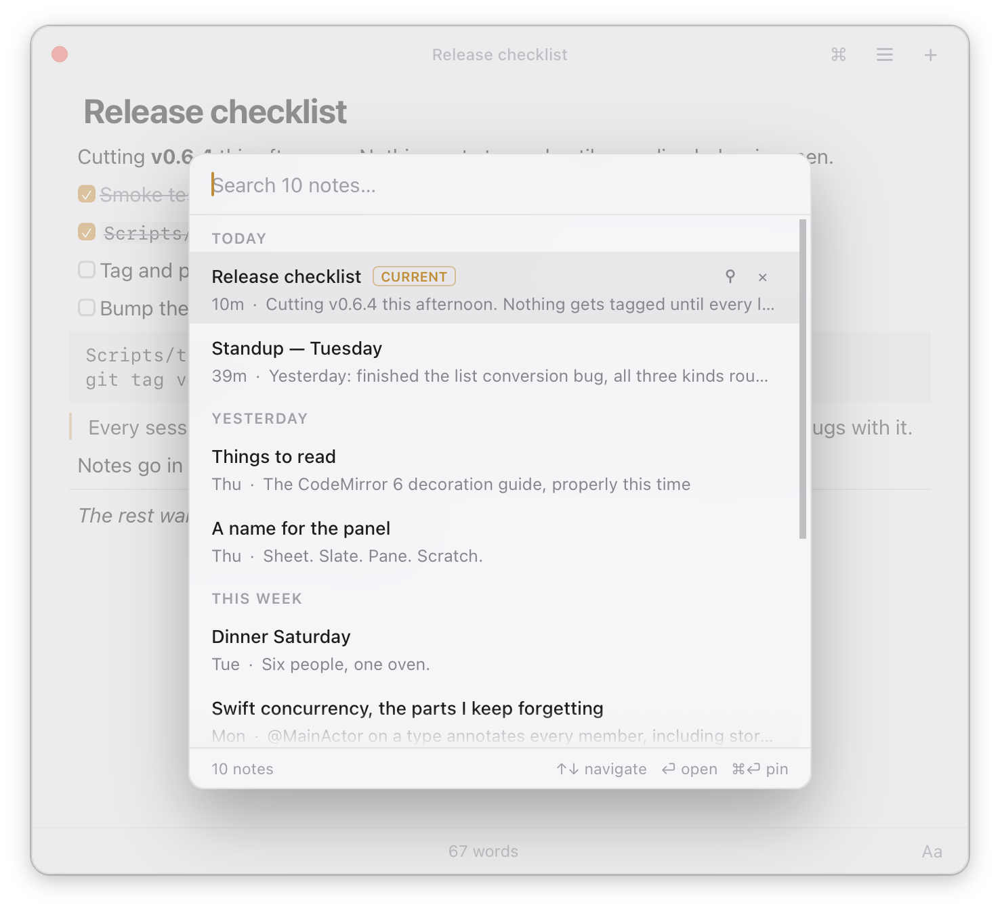
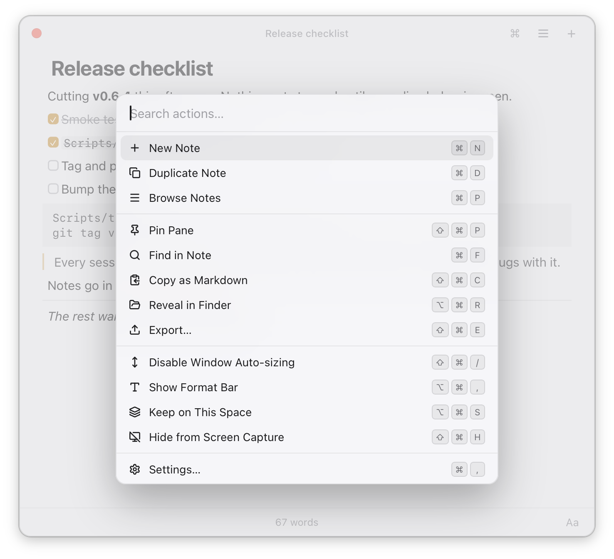
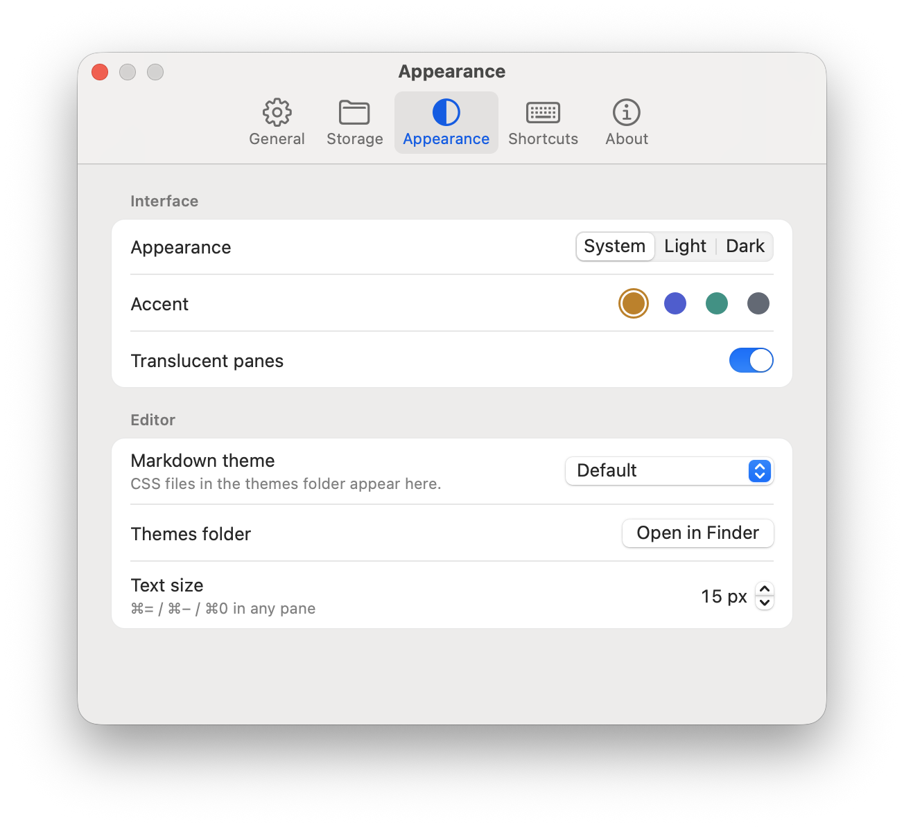
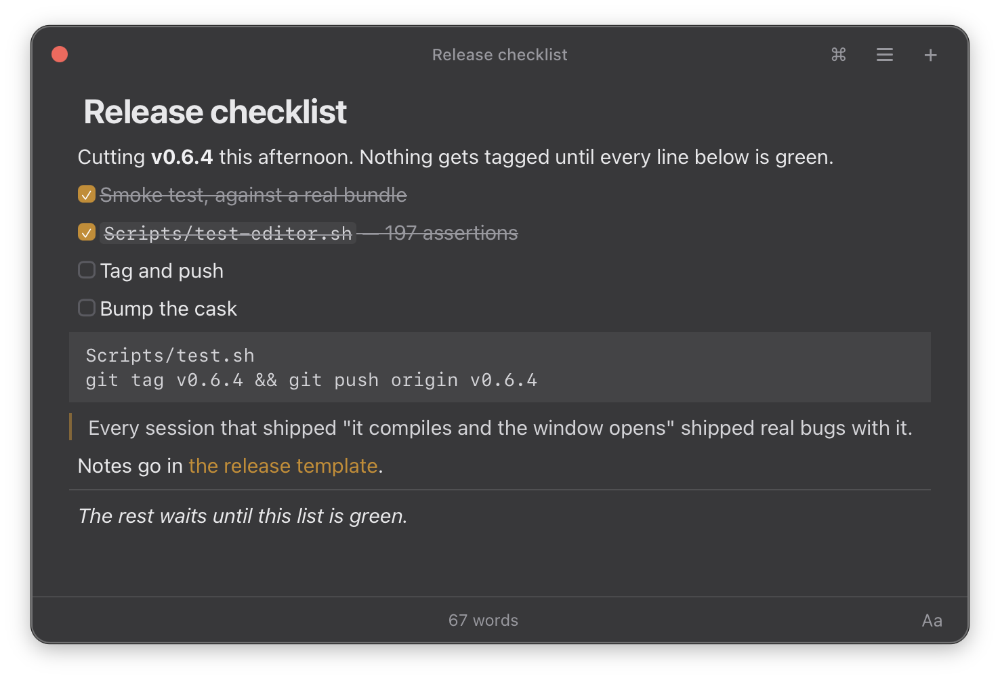

<p align="center">
  
</p>

<h1 align="center">Plume</h1>

<p align="center">
  一键呼出的 macOS 浮动笔记，Raycast Notes 的免费开源替代。
</p>

<p align="center">
  <a href="README.md">English</a> · 简体中文
</p>

<p align="center">
  <a href="LICENSE"></a>
  
  
  <a href="https://github.com/tiylabs/plume/releases"></a>
</p>

<p align="center">
  
</p>

按 <kbd>⌃⌥Space</kbd>，笔记就浮到当前窗口上，写完再按一下就收起，接着干手里的活。

Markdown 实时渲染，笔记就是文件夹里的 `.md` 文件。不需要装 Raycast，不限笔记数量，也没有注册账号。

## 安装

```bash
brew install --cask tiylabs/tap/plume
```

或者到 [Releases](https://github.com/tiylabs/plume/releases/latest) 下载 `.dmg`，把 Plume 拖进
Applications。

发布版使用 Apple Developer ID 签名并通过 Apple 公证，首次打开不需要任何额外操作。

## 和 Raycast Notes 比

|          | Raycast Notes          | Plume                                 |
| -------- | ---------------------- | ------------------------------------ |
| 笔记数量 | 免费版 5 篇            | 不限                                 |
| 存在哪   | Raycast 内部           | 你自己的文件夹，普通 `.md` 文件      |
| 同步     | Pro 才有               | iCloud 云盘、Syncthing，随你选       |
| 价格     | 免费版 + Pro 订阅      | 免费，MIT 开源                       |

快捷键和操作习惯尽量和 Raycast Notes 保持一致，迁移过来基本不用重新适应。

## 能做什么

<p align="center">
  
  
</p>

- 全局快捷键呼出，打开的就是你上次写的那篇。
- 实时渲染：标题、列表、引用、代码块不会露出符号，粗体、链接这些只在光标停留时显示源码。
- <kbd>⌘P</kbd> 切换笔记，支持模糊搜索和全文搜索，搜不到就直接回车新建。
- <kbd>⌘K</kbd> 打开所有操作：查找、导出、在访达中显示、重命名、截图录屏时隐藏、最近删除。
- 窗口高度跟着内容走，能浮在全屏应用上面，支持深色模式。
- 用别的编辑器改了文件，Plume 会自动读进来；真遇到冲突会另存一份，不会覆盖。
- 删掉的笔记可以找回来。

## 笔记存在哪

在 Plume 中，笔记就是一个文件夹里的普通 Markdown 文件，默认在 `~/Documents/Plume`。第一行就是标题，不加
frontmatter，也没有数据库，用什么编辑器打开都行。

多台 Mac 之间同步：在设置的 Storage 里选 iCloud Drive，或者把笔记放进 Syncthing 这类工具管理的
文件夹，更推荐 iCloud Drive。

## 设置和主题

<p align="center">
  
  
</p>

<kbd>⌘,</kbd> 打开设置。所有设置都存在 `settings.json` 里，手动改完立刻生效。

主题就是一个 CSS 文件，丢进 `~/Library/Application Support/Plume/Themes` 就能在设置里选：

```css
:root {
  --font-ui: "LXGW WenKai", serif;      /* 正文字体 */
  --font-mono: "JetBrains Mono", monospace;
  --text-size: 16px;
  --accent: #4a7fb5;                   /* 链接、光标等的颜色 */
}
```

## 隐私

Plume 不会去申请任何系统权限，没有统计，没有账号，也没有服务器，也没有加入 AI 功能的打算。这里唯一联网就是去 GitHub 看看有没有新版本更新，也同样可以在设置里关掉。

## 从源码构建

不需要 Xcode，装了 Command Line Tools 就能编译：

```bash
Scripts/test-all.sh
make dev                      # 编译并启动独立的开发版 build/Plume Dev.app
Scripts/build-app.sh --release # 构建正式版 build/Plume.app
```

开发版使用独立的应用标识和设置，笔记默认存放在 app 同级的 `build/Plume-scratch`，
`make clean` 会保留这些笔记。默认快捷键为 `⌃⌥⇧Space`，不会退出已运行的正式版。

## 许可证

MIT，详见 [LICENSE](LICENSE)。应用内打包的第三方组件见 [THIRD_PARTY_NOTICES.md](THIRD_PARTY_NOTICES.md)。

本项目 fork 自 Cole Mei 的 [ColeMei/pane](https://github.com/ColeMei/pane)（同为 MIT 协议），
分叉自上游提交 `526dda4`，此后独立开发，并由 Pane 更名为 Plume。本项目与上游项目及其作者无隶属或背书关系。

## 致谢

感谢 [linux.do](https://linux.do) 社区。
